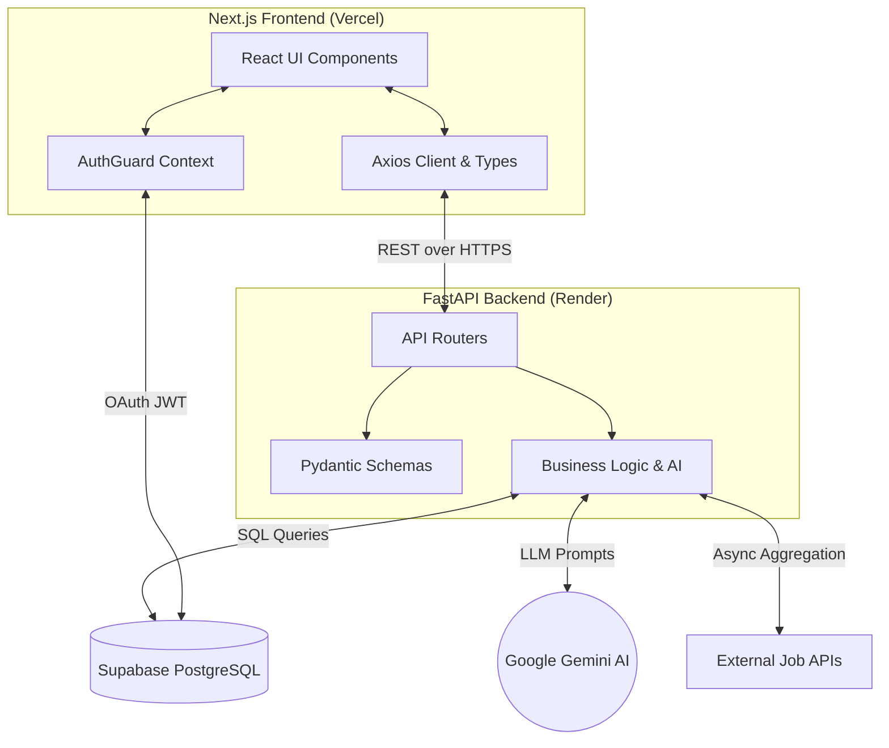

<div align="center">

# 🤖 Job Finder AI 
### Your Intelligent Career Companion

[](https://nextjs.org/)
[](https://fastapi.tiangolo.com/)
[](https://supabase.com/)
[](https://ai.google.dev/)
[](https://www.typescriptlang.org/)

**An enterprise-grade, full-stack AI platform that aggregates job listings, parses your resume via LLMs, and acts as a personalized career coach.**

[Live Demo](https://job-finder-ai-kappa.vercel.app) • [Backend API](https://job-finder-ai-backend.onrender.com) • [Report a Bug](https://github.com/KhuzaimaHassan/job-finder-ai/issues)

</div>

---

## 📖 Overview

Job Finder AI transforms the exhausting process of job hunting into a streamlined, automated, and highly personalized experience. Built on a robust **Next.js** frontend and a highly scalable **FastAPI** backend, the platform aggregates real-time job listings across multiple global boards.

Instead of manually reading descriptions, users upload their PDF resumes to our **Google Gemini** ingestion pipeline. The AI then acts as an interactive "Co-Pilot," scoring applications, generating bespoke cover letters, identifying skill gaps, and generating highly targeted interview preparation questions for every single job.

---

## ✨ Core Features & Capabilities

### 🧠 The AI Co-Pilot
- **Intelligent ATS Scoring:** Evaluates your parsed resume against the specific job description to generate a compatibility score.
- **Dynamic Cover Letters:** Context-aware cover letter generation tailored to the hiring company and required skills.
- **Skill Gap Analysis:** Highlights exact technical deficiencies between your profile and the job posting, suggesting targeted learning paths.
- **Interview Simulator:** Generates role-specific behavioral and technical interview questions to prep you before you hit apply.

### 🔍 Real-Time Job Aggregation Engine
- **Multi-Source Fetching:** Seamlessly aggregates from Adzuna, Remotive, RemoteOK, and JSearch via asynchronous Python workers.
- **Automated Job Caching:** APScheduler runs background tasks to continually update the PostgreSQL database every 6 hours, ensuring zero latency on the frontend.
- **Smart Filtering:** Advanced filtering by location, tech stack, and remote flexibility.

### 📊 Application Tracking System (ATS)
- **Interactive Kanban Board:** Drag-and-drop interface powered by `@hello-pangea/dnd`.
- **Pipeline Tracking:** Visualize your funnel (Saved → Applied → Interviewing → Offer → Rejected).
- **Persistent State:** Live synchronization with Supabase to track notes and status updates securely.

### 🔒 Enterprise-Grade Security
- **Supabase Auth:** Google OAuth integration with strict session management.
- **Row-Level Security (RLS):** All Postgres tables are guarded by RLS policies; users can mathematically only ever query or mutate their own data.

---

## 🛠️ Technology Stack

We selected our stack to optimize for **type-safety, raw performance, and AI interoperability**.

| Layer | Technologies | Purpose |
| :--- | :--- | :--- |
| **Frontend** | React, Next.js 15 (App Router), TypeScript | Server-Side Rendering, SEO, Type-safe components |
| **Styling & UI** | Tailwind CSS v4, shadcn/ui, Lucide | Dark-mode glassmorphism, responsive native layouts |
| **Backend** | Python 3.12, FastAPI, Pydantic, Uvicorn | High-concurrency async API, strict schema validation |
| **Artificial Intelligence** | Google Gemini 2.5 Flash | Fast, token-efficient LLM inference and PDF parsing |
| **Database & Auth** | Supabase (PostgreSQL) | Managed relational data, RLS, Google OAuth |
| **Infrastructure** | Vercel (Frontend), Render (Backend) | Edge networking, CI/CD, Containerized deployments |

---

## 🏗️ System Architecture

Our repository strictly follows Senior Developer conventions, enforcing separation of concerns across both environments.

### Data Flow & Micro-Architecture


### Clean Codebase Structure
```text
job-finder-ai/
├── backend/                       # Python FastAPI Monolithic API
│   ├── app/
│   │   ├── main.py                # Entrypoint & CORS Middleware
│   │   ├── routers/               # Route Controllers (Jobs, AI, Auth)
│   │   ├── schemas/               # Pydantic Validation Models
│   │   └── services/              # Business Logic & 3rd Party Integrations
│   └── requirements.txt
├── frontend/                      # TypeScript Next.js App
│   ├── src/
│   │   ├── app/                   # App Router Pages & Layouts
│   │   ├── components/            # Reusable UI & Complex Modals
│   │   ├── lib/                   # API Clients & Utility Functions
│   │   └── types/                 # Centralized TypeScript Interfaces
│   ├── tailwind.config.ts
│   └── package.json
├── render.yaml                    # Infrastructure as Code (Backend)
└── supabase_setup.sql             # DB Schema Migrations & RLS Policies
```

---

## 🚀 Local Development Setup

We've made bootstrapping the environment as frictionless as possible.

### Prerequisites
- Node.js (v18+)
- Python (v3.11+)
- API Keys: [Supabase](https://supabase.com/), [Google AI Studio](https://aistudio.google.com/), [Adzuna](https://developer.adzuna.com/)

### 1. Database Initialization
Execute the contents of `supabase_setup.sql` in your Supabase SQL Editor. This will provision the tables (`profiles`, `resumes`, `applications`) and lock them down with Row-Level Security.

### 2. Backend Environment
Navigate into the backend, initialize a virtual environment, and boot the ASGI server.
```bash
cd backend
python -m venv venv
source venv/bin/activate  # Or `venv\Scripts\activate` on Windows
pip install -r requirements.txt

# Populate your .env file
cp .env.example .env

# Run the API in development mode
uvicorn app.main:app --reload --host 0.0.0.0 --port 8000
```
*API Documentation available at: `http://localhost:8000/docs`*

### 3. Frontend Environment
Navigate into the frontend, install the NPM packages, and spin up the Next.js dev server.
```bash
cd frontend
npm install

# Populate your .env.local file
cp .env.local.example .env.local

# Run the Web App
npm run dev
```
*Web App available at: `http://localhost:3000`*

---

## 🚢 Deployment Strategy

The application is fully configured for CI/CD via GitHub integrations.

- **Frontend (Vercel):** Connect your fork to Vercel. Ensure `Root Directory` is set to `frontend`. Populate the environment variables. Pushes to `main` auto-deploy to edge networks.
- **Backend (Render):** Connect your fork to Render via a Blueprint deployment. Render natively reads `render.yaml` to provision a Python web service, install dependencies, and expose the dynamic `$PORT`.

---

## 📝 License

Distributed under the MIT License. See `LICENSE` for more information.

---
<div align="center">
  <b>Architected and Engineered by <a href="https://github.com/KhuzaimaHassan">Khuzaima Hassan</a></b><br>
  <i>Built with uncompromising standards for modern AI application development.</i>
</div>
